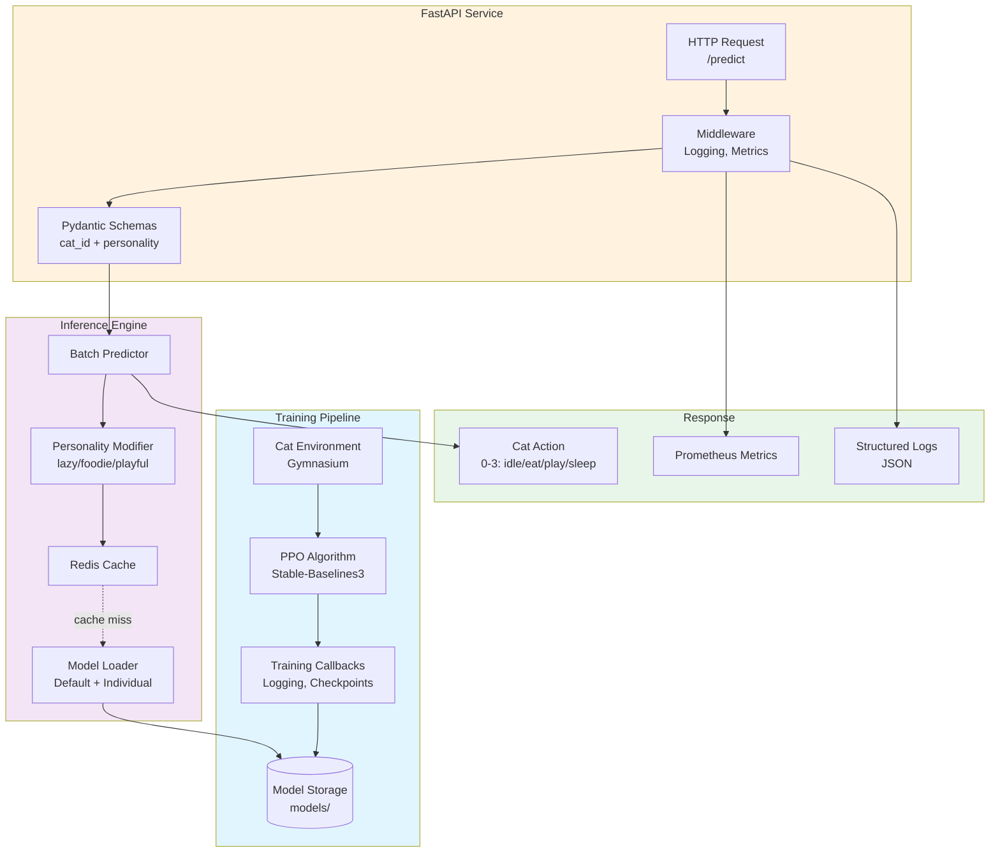
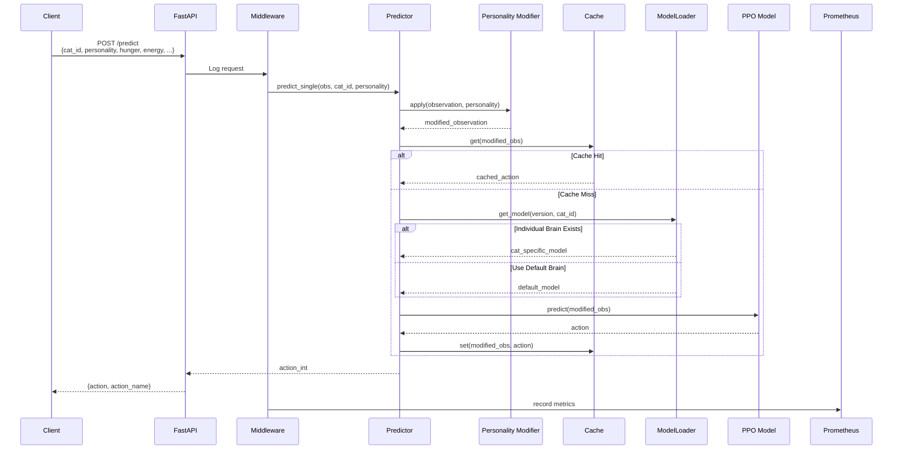
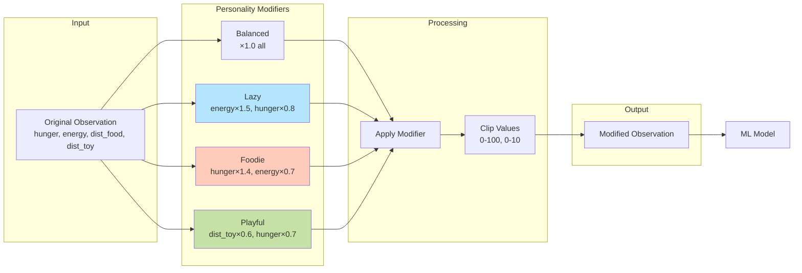
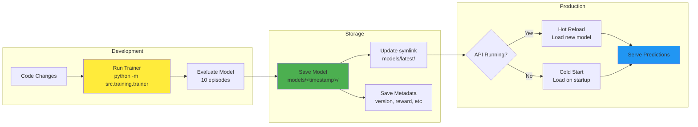
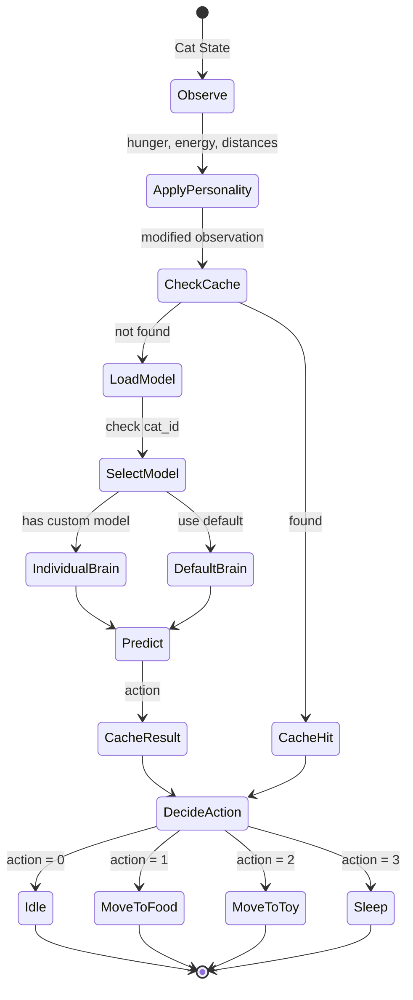
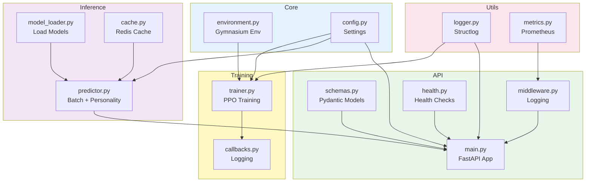

# Cat Brain Service

## System



## Request Flow



## Model Selection Logic


## Personality System



## Training



## Cat Decision Making



## Component Dependencies


## How to Actually Run This Thing

### Dev Mode

```bash
# Install deps (use venv, don't be that person)
python -m venv venv
.\venv\Scripts\activate  # windows gang
pip install -r requirements.txt

# Run the API (hot reload included, cuz we're civilized)
uvicorn src.api.main:app --reload --host 0.0.0.0 --port 8000

# Or train a new brain (takes ~1 min depending on your potato)
python -m src.training.trainer
```

### Docker

```bash
cd docker
docker-compose up --build  # grab some coffee, first build takes a min
```

API's at `localhost:8000`, docs at `localhost:8000/docs` (FastAPI auto-docs ftw)

## Important Stuff You Should Know

### Cache TTL & Why It Matters

Redis cache is set to **1hr TTL** by default. Why? Cuz cat behaviors change throughout the day irl. If you're testing and cache is screwing with you:
- Either wait it out (lol no)
- Restart Redis: `docker restart cat-brain-redis`
- Or just change `CACHE_TTL` in config

### Model Versioning

Models are saved as `models/<timestamp>/` and `models/latest/` is a symlink. Why?
- API always loads from `latest/` 
- You can rollback by just changing the symlink
- Individual cat brains live in `models/cats/<cat_id>/latest/`

**IMPORTANT**: If you train a new default brain and your cats start acting weird, it's cuz they're using the new default (unless they have individual brains). Check `metadata.json` to see what version is actually loaded.

### Personality Modifiers

Personalities aren't trained - they're multipliers applied at inference. This means:
- Zero overhead, instant switching
- Same model serves all personalities
- But also means they're not "real" learned behaviors, just biases

For custom personalities, just add to `personality_config` in [config.py](src/core/config.py) and restart the API. Format's pretty obvious when you see it.

### Individual Brains vs Default

When you request with `cat_id="fluffy"`:
1. Checks `models/cats/fluffy/latest/` first
2. Falls back to `models/latest/` if not found
3. Both get cached separately (different cache keys)

**Gotcha**: Individual brains need to be trained explicitly. The trainer doesn't auto-create them. You gotta run training with a specific cat context (not implemented yet, but that's the plan).

### Metrics & Monitoring

Prometheus metrics live at `/metrics`. Key ones to watch:
- `prediction_duration_seconds` - if this spikes, cache is prob down or model loading is slow
- `cache_hit_rate` - should be >70% in prod, otherwise you're burning CPU
- `model_load_duration_seconds` - first load is slow (10-15s), cached loads are instant


### Logs & Debugging

Logs are JSON (structured logging via structlog). Grep-friendly:
```bash
# Filter by level
cat logs.json | jq 'select(.level=="error")'

# Track specific cat
cat logs.json | jq 'select(.cat_id=="fluffy")'

# Monitor cache performance
cat logs.json | jq 'select(.event=="cache_access")'
```

Set `LOG_LEVEL=DEBUG` for verbose output (warning: it's VERY verbose during training).

### API Response Times

Typical latencies:
- Cache hit: ~5-10ms
- Cache miss (model loaded): ~20-50ms  
- First request (cold start): ~10-15s (loading model from disk)

If you're seeing >100ms on cached requests, something's wrong (check Redis connection, network, or if you're running on a toaster).

### When to Retrain

Signs you need a new model:
- Cats doing dumb stuff (sleeping when starving, ignoring food when hungry)
- Reward plateau in training (check tensorboard)
- Added new features to environment and model doesn't use them

Otherwise, just tweak personalities - way faster than retraining.