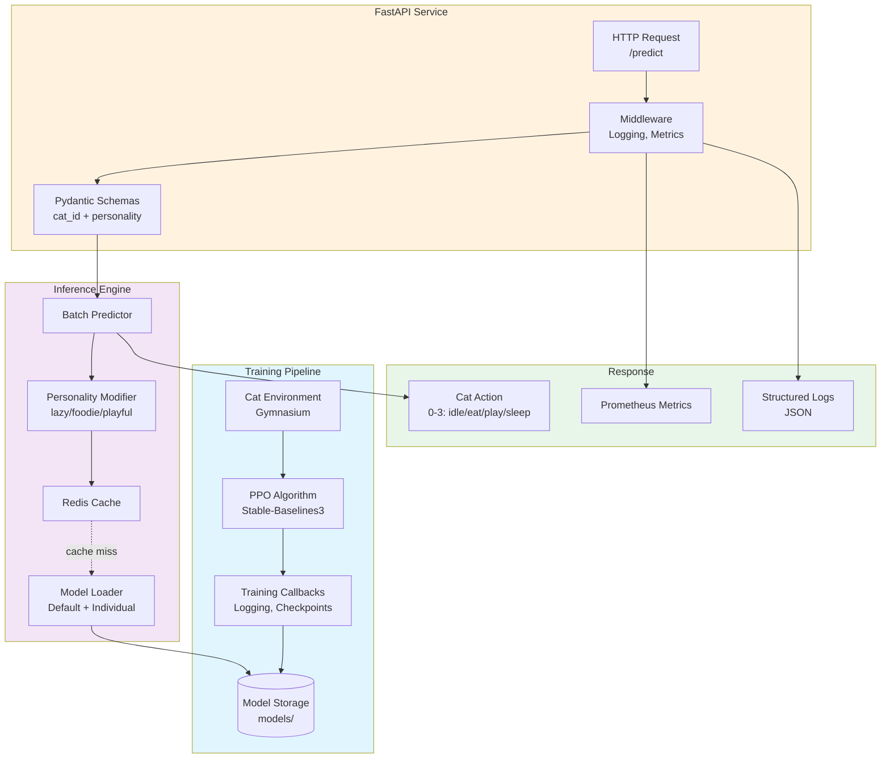
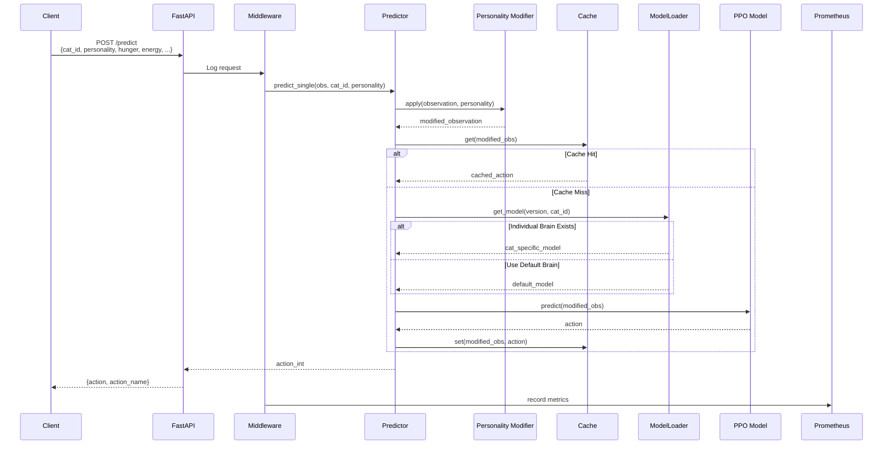
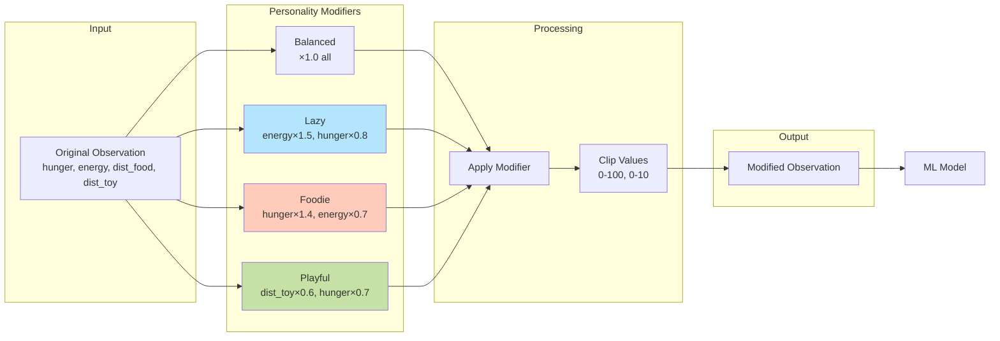
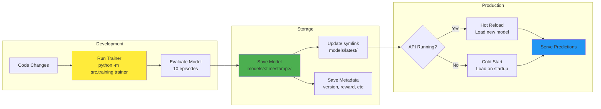
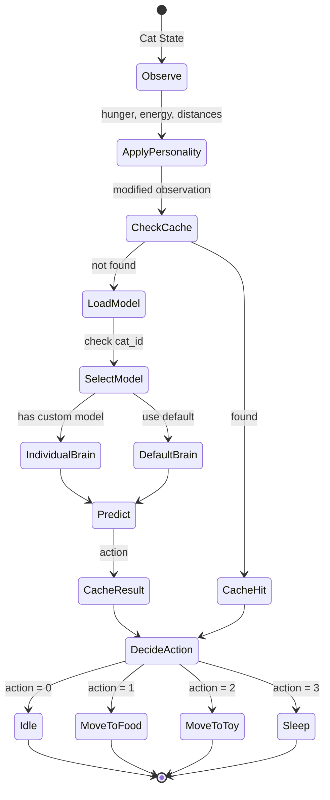
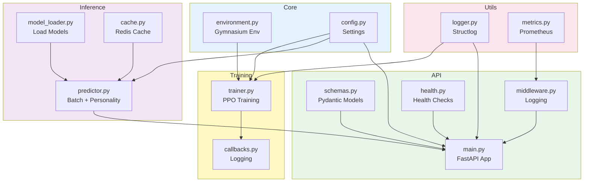

# Cat Brain Service

## System

```mermaid
graph TB
    subgraph Training["Training Pipeline"]
        ENV[Cat Environment<br/>Gymnasium]
        PPO[PPO Algorithm<br/>Stable-Baselines3]
        CALLBACKS[Training Callbacks<br/>Logging, Checkpoints]
        MODELS[(Model Storage<br/>models/)]
        
        ENV --> PPO
        PPO --> CALLBACKS
        CALLBACKS --> MODELS
    end
    
    subgraph API["FastAPI Service"]
        REQUEST[HTTP Request<br/>/predict]
        SCHEMAS[Pydantic Schemas<br/>cat_id + personality]
        MIDDLEWARE[Middleware<br/>Logging, Metrics]
        
        REQUEST --> MIDDLEWARE
        MIDDLEWARE --> SCHEMAS
    end
    
    subgraph Inference["Inference Engine"]
        PREDICTOR[Batch Predictor]
        PERSONALITY[Personality Modifier<br/>lazy/foodie/playful]
        CACHE[Redis Cache]
        LOADER[Model Loader<br/>Default + Individual]
        
        SCHEMAS --> PREDICTOR
        PREDICTOR --> PERSONALITY
        PERSONALITY --> CACHE
        CACHE -.cache miss.-> LOADER
        LOADER --> MODELS
    end
    
    subgraph Output["Response"]
        ACTION[Cat Action<br/>0-3: idle/eat/play/sleep]
        METRICS[Prometheus Metrics]
        LOGS[Structured Logs<br/>JSON]
        
        PREDICTOR --> ACTION
        MIDDLEWARE --> METRICS
        MIDDLEWARE --> LOGS
    end
    
    style Training fill:#e1f5ff
    style API fill:#fff3e0
    style Inference fill:#f3e5f5
    style Output fill:#e8f5e9
```

## Request Flow

```mermaid
sequenceDiagram
    participant Client
    participant API as FastAPI
    participant Middleware
    participant Predictor
    participant PersonalityMod as Personality Modifier
    participant Cache
    participant ModelLoader
    participant Model as PPO Model
    
    Client->>API: POST /predict<br/>{cat_id, personality, hunger, energy, ...}
    API->>Middleware: Log request
    Middleware->>Predictor: predict_single(obs, cat_id, personality)
    
    Predictor->>PersonalityMod: apply(observation, personality)
    PersonalityMod-->>Predictor: modified_observation
    
    Predictor->>Cache: get(modified_obs)
    
    alt Cache Hit
        Cache-->>Predictor: cached_action
    else Cache Miss
        Predictor->>ModelLoader: get_model(version, cat_id)
        
        alt Individual Brain Exists
            ModelLoader-->>Predictor: cat_specific_model
        else Use Default Brain
            ModelLoader-->>Predictor: default_model
        end
        
        Predictor->>Model: predict(modified_obs)
        Model-->>Predictor: action
        Predictor->>Cache: set(modified_obs, action)
    end
    
    Predictor-->>API: action_int
    API-->>Client: {action, action_name}
    Middleware->>Prometheus: record metrics
```

## Model Selection Logic

```mermaid
flowchart TD
    START([Request with cat_id]) --> CHECK_ID{cat_id<br/>provided?}
    
    CHECK_ID -->|No| DEFAULT[Use Default Brain<br/>models/latest/]
    CHECK_ID -->|Yes| CHECK_INDIVIDUAL{Individual model<br/>exists?}
    
    CHECK_INDIVIDUAL -->|Yes| INDIVIDUAL[Load Cat Brain<br/>models/cats/&lt;cat_id&gt;/latest/]
    CHECK_INDIVIDUAL -->|No| DEFAULT
    
    DEFAULT --> LOAD_DEFAULT[Load from cache<br/>or disk]
    INDIVIDUAL --> LOAD_INDIVIDUAL[Load from cache<br/>or disk]
    
    LOAD_DEFAULT --> PREDICT[Predict Action]
    LOAD_INDIVIDUAL --> PREDICT
    
    PREDICT --> END([Return Action])
    
    style DEFAULT fill:#90caf9
    style INDIVIDUAL fill:#ce93d8
    style PREDICT fill:#a5d6a7
```

## Personality System

```mermaid
graph LR
    subgraph Input
        OBS[Original Observation<br/>hunger, energy, dist_food, dist_toy]
    end
    
    subgraph Modifiers["Personality Modifiers"]
        BALANCED[Balanced<br/>×1.0 all]
        LAZY[Lazy<br/>energy×1.5, hunger×0.8]
        FOODIE[Foodie<br/>hunger×1.4, energy×0.7]
        PLAYFUL[Playful<br/>dist_toy×0.6, hunger×0.7]
    end
    
    subgraph Processing
        APPLY[Apply Modifier] --> CLIP[Clip Values<br/>0-100, 0-10]
    end
    
    subgraph Output
        MODIFIED[Modified Observation]
    end
    
    OBS --> BALANCED & LAZY & FOODIE & PLAYFUL
    BALANCED & LAZY & FOODIE & PLAYFUL --> APPLY
    CLIP --> MODIFIED
    MODIFIED --> MODEL[ML Model]
    
    style LAZY fill:#b3e5fc
    style FOODIE fill:#ffccbc
    style PLAYFUL fill:#c5e1a5
```

## Training

```mermaid
flowchart LR
    subgraph Development
        CODE[Code Changes] --> TRAIN[Run Trainer<br/>python -m src.training.trainer]
        TRAIN --> EVAL[Evaluate Model<br/>10 episodes]
    end
    
    subgraph Storage
        EVAL --> SAVE[Save Model<br/>models/&lt;timestamp&gt;/]
        SAVE --> SYMLINK[Update symlink<br/>models/latest/]
        SAVE --> META[Save Metadata<br/>version, reward, etc]
    end
    
    subgraph Production
        SYMLINK --> RELOAD{API Running?}
        RELOAD -->|Yes| HOT[Hot Reload<br/>Load new model]
        RELOAD -->|No| COLD[Cold Start<br/>Load on startup]
        HOT --> SERVE[Serve Predictions]
        COLD --> SERVE
    end
    
    style TRAIN fill:#ffeb3b
    style SAVE fill:#4caf50
    style SERVE fill:#2196f3
```

## Cat Decision Making

```mermaid
stateDiagram-v2
    [*] --> Observe: Cat State
    Observe --> ApplyPersonality: hunger, energy, distances
    ApplyPersonality --> CheckCache: modified observation
    
    CheckCache --> CacheHit: found
    CheckCache --> LoadModel: not found
    
    LoadModel --> SelectModel: check cat_id
    SelectModel --> IndividualBrain: has custom model
    SelectModel --> DefaultBrain: use default
    
    IndividualBrain --> Predict
    DefaultBrain --> Predict
    
    Predict --> CacheResult: action
    CacheResult --> DecideAction
    CacheHit --> DecideAction
    
    DecideAction --> Idle: action = 0
    DecideAction --> MoveToFood: action = 1
    DecideAction --> MoveToToy: action = 2
    DecideAction --> Sleep: action = 3
    
    Idle --> [*]
    MoveToFood --> [*]
    MoveToToy --> [*]
    Sleep --> [*]
```

## Component Dependencies

```mermaid
graph TD
    subgraph Core
        ENV[environment.py<br/>Gymnasium Env]
        CONFIG[config.py<br/>Settings]
    end
    
    subgraph Training
        TRAINER[trainer.py<br/>PPO Training]
        CALLBACKS[callbacks.py<br/>Logging]
    end
    
    subgraph Inference
        LOADER[model_loader.py<br/>Load Models]
        PREDICTOR[predictor.py<br/>Batch + Personality]
        CACHE_MOD[cache.py<br/>Redis Cache]
    end
    
    subgraph API
        MAIN[main.py<br/>FastAPI App]
        SCHEMAS[schemas.py<br/>Pydantic Models]
        MIDDLEWARE_MOD[middleware.py<br/>Logging]
        HEALTH[health.py<br/>Health Checks]
    end
    
    subgraph Utils
        LOGGER[logger.py<br/>Structlog]
        METRICS_MOD[metrics.py<br/>Prometheus]
    end
    
    CONFIG --> TRAINER
    CONFIG --> PREDICTOR
    CONFIG --> MAIN
    
    ENV --> TRAINER
    TRAINER --> CALLBACKS
    
    LOADER --> PREDICTOR
    CACHE_MOD --> PREDICTOR
    
    SCHEMAS --> MAIN
    PREDICTOR --> MAIN
    MIDDLEWARE_MOD --> MAIN
    HEALTH --> MAIN
    
    LOGGER --> TRAINER
    LOGGER --> MAIN
    METRICS_MOD --> MIDDLEWARE_MOD
    
    style Core fill:#e3f2fd
    style Training fill:#fff9c4
    style Inference fill:#f3e5f5
    style API fill:#e8f5e9
    style Utils fill:#fce4ec
```
