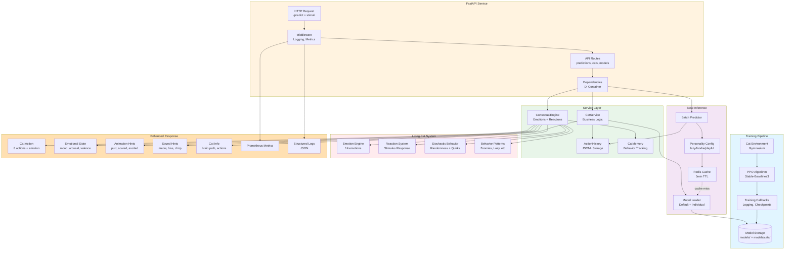
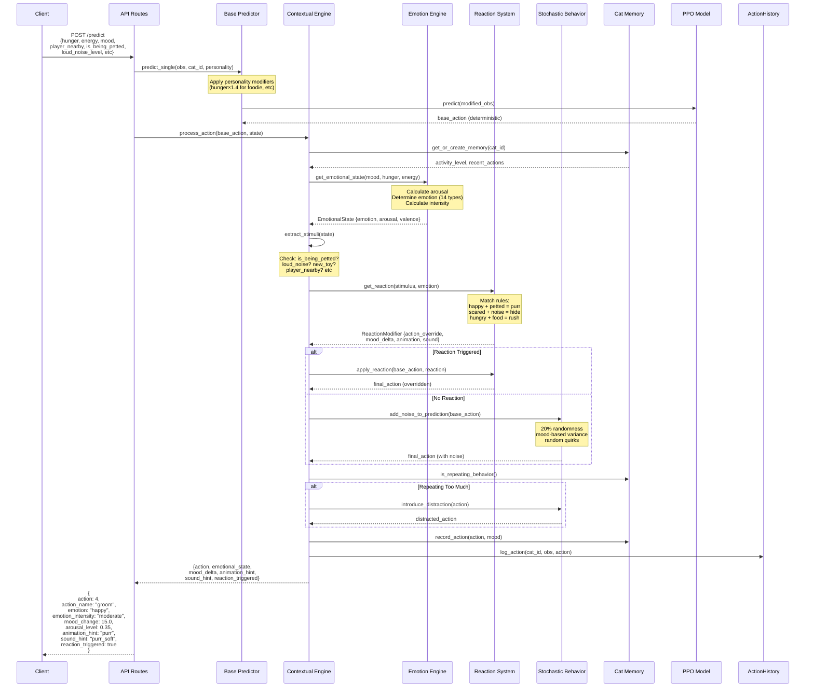
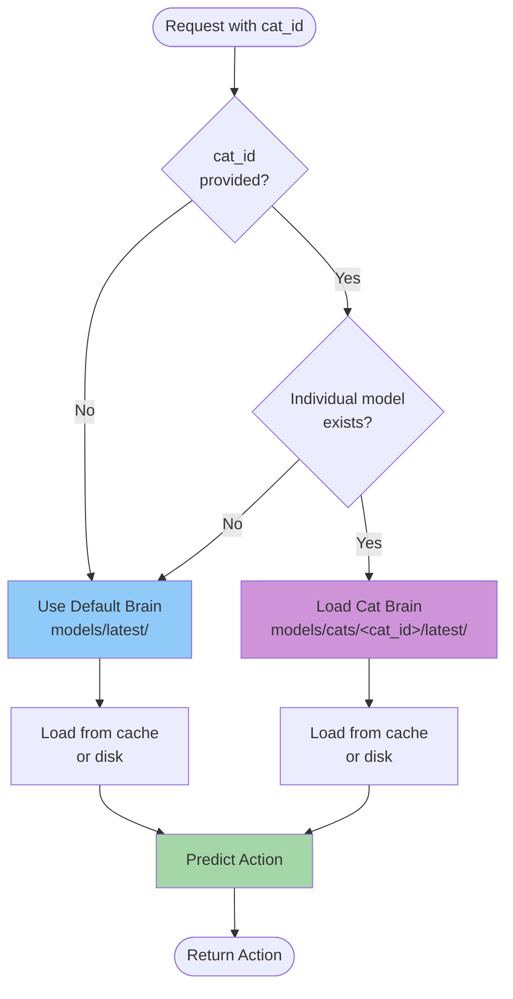
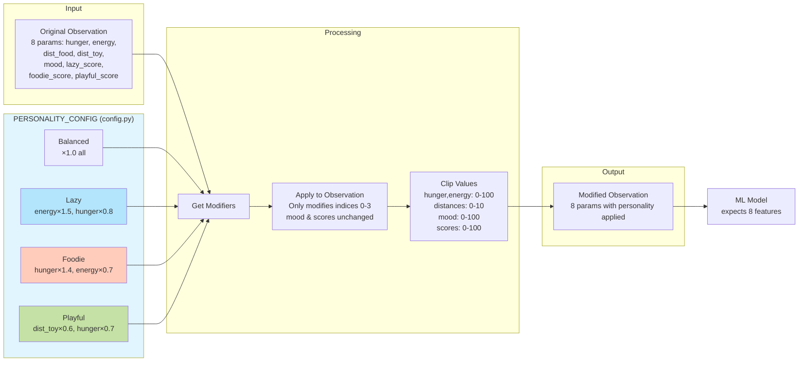
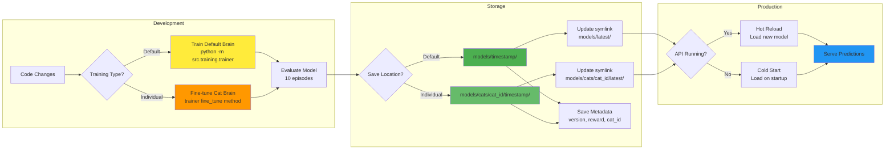
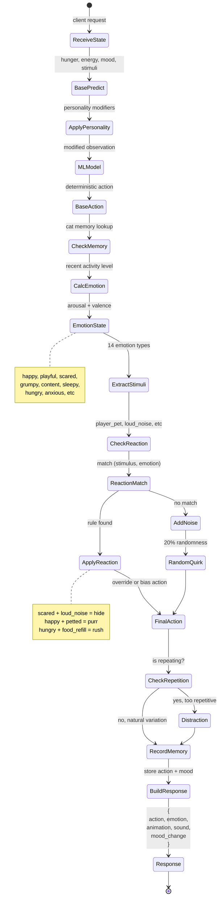
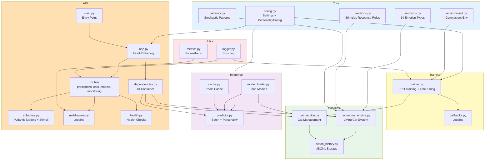

# Cat Brain Service

living cat ai with emotions, reactions, and realistic behavior

## System Architecture



## Request Flow with Living Cat System



## Model Selection Logic



## Personality System



## Training



## Living Cat Decision Flow



## Component Dependencies


## How to Actually Run This Thing

### Dev Mode

```bash
python -m venv venv
.\venv\Scripts\activate
pip install -r requirements.txt

uvicorn src.api.main:app --reload --host 0.0.0.0 --port 8000

python -m src.training.trainer
```

### Docker

```bash
cd docker
docker-compose up --build
```

api: `localhost:8000`  
docs: `localhost:8000/docs`

## Living Cat Features

### 14 emotional states
- **positive**: happy, excited, playful, affectionate, content, relaxed
- **negative**: scared, anxious, grumpy, annoyed  
- **neutral**: curious, sleepy, hungry, demanding

emotions calculated from mood, hunger, energy, arousal

### environmental stimuli
- `player_pet` - being petted
- `player_call` - player calling
- `loud_noise` - environmental noise (0-1)
- `new_toy` - toy appeared
- `food_refill` - bowl refilled
- `player_approach` - player nearby
- `sudden_movement` - unexpected motion

### reactions
emotion + stimulus = unique response:
- happy + petted = purr (85% chance)
- scared + loud_noise = hide (95% chance)
- hungry + food_refill = rush to food (95% chance)
- grumpy + petted = tail flick (60% chance)

### unpredictability
- 20% base randomness
- mood-based variance
- spontaneous quirks (grooming, exploring)
- attention span modifiers
- behavioral patterns (zoomies, lazy sunday, midnight madness)

### memory system
tracks last 50 actions:
- prevents robotic repetition
- calculates activity levels
- introduces distractions if too repetitive

## api usage

### minimal request
```json
POST /predict
{
  "hunger": 60.0,
  "energy": 50.0,
  "distance_to_food": 5.0,
  "distance_to_toy": 10.0,
  "mood": 55.0
}
```

### full living cat request
```json
POST /predict
{
  "cat_id": "whiskers",
  "personality": "playful",
  "hunger": 45.0,
  "energy": 70.0,
  "distance_to_food": 8.0,
  "distance_to_toy": 3.0,
  "mood": 75.0,
  "lazy_score": 30.0,
  "foodie_score": 50.0,
  "playful_score": 80.0,
  
  "player_nearby": true,
  "player_distance": 12.0,
  "is_being_petted": false,
  "is_player_calling": true,
  "loud_noise_level": 0.0,
  "new_toy_appeared": false,
  "food_bowl_refilled": false,
  "sudden_movement": false,
  "time_of_day": "evening"
}
```

### enhanced response
```json
{
  "action": 5,
  "action_name": "play",
  "emotion": "playful",
  "emotion_intensity": "strong",
  "mood_change": 12.0,
  "arousal_level": 0.65,
  "animation_hint": "playful_approach",
  "sound_hint": "chirp",
  "reaction_triggered": true
}
```

## unity integration

### send state
```csharp
var response = await brainService.Predict(new CatState {
    hunger = catStats.hunger,
    energy = catStats.energy,
    mood = catStats.mood,
    is_being_petted = isPetting,
    loud_noise_level = GetEnvironmentNoise(),
    player_nearby = IsPlayerNearby()
});
```

### apply response
```csharp
ExecuteCatAction(response.action);

if (!string.IsNullOrEmpty(response.animation_hint)) {
    animator.Play(response.animation_hint);
}

if (!string.IsNullOrEmpty(response.sound_hint)) {
    audioSource.PlayOneShot(GetSound(response.sound_hint));
}

catStats.mood += response.mood_change;
```

### animation hints
- `purr` - happy purring
- `scared` - frightened
- `excited` - bouncy
- `startle` - sudden jump
- `hide` - run and hide
- `run_to_food` - sprint to bowl
- `playful_approach` - bouncy walk
- `rub_legs` - affection
- `tail_flick` - annoyance
- `ignore` - turn away

### sound hints
- `purr` / `purr_soft` - purring
- `meow_excited` / `meow_annoyed` / `meow_urgent` - various meows
- `meow_response` - acknowledgment
- `hiss` - scared/angry
- `chirp` - playful trill

## Important Stuff You Should Know

### living cat system
model provides base action, then:
1. **emotion engine** calculates emotional state (14 types)
2. **reaction system** checks for stimulus responses  
3. **stochastic layer** adds 20% randomness
4. **memory** prevents repetitive behavior
5. **contextual engine** combines everything

result: unpredictable, lifelike cat behavior

### cache ttl
redis cache set to **5min ttl** (caching base ml predictions only)
reactions and emotions calculated real-time every request

restart redis: `docker restart cat-brain-redis`  
change ttl: `CACHE_TTL` in config (seconds)

### response latencies
- cache hit: ~10-15ms (ml cached, emotions calculated)
- cache miss: ~30-60ms (ml + emotions)
- first request: ~10-15s (model loading)

living cat processing adds ~5-10ms (emotion + reaction calculations)

### model versioning
models saved as `models/<timestamp>/`  
`models/latest/` is symlink  
individual cats: `models/cats/<cat_id>/latest/`

check `metadata.json` for loaded version

### personality modifiers
personalities are multipliers at inference (not trained)  
add custom personalities in [config.py](src/core/config.py)

format:
```python
PERSONALITY_CONFIG = {
    "custom": {
        "hunger": 1.2,
        "energy": 0.9,
        "distance_food": 0.8,
        "distance_toy": 1.1
    }
}
```

### individual brains vs default
request with `cat_id="fluffy"`:
1. checks `models/cats/fluffy/latest/`
2. falls back to `models/latest/`
3. cached separately

individual brains must be trained explicitly

### metrics & monitoring
prometheus metrics at `/metrics`

key metrics:
- `prediction_duration_seconds` - should be <100ms
- `cache_hit_rate` - should be >70%
- `model_load_duration_seconds` - first load 10-15s, cached instant

### logs & debugging
structured json logs (structlog)

```bash
cat logs.json | jq 'select(.level=="error")'
cat logs.json | jq 'select(.cat_id=="fluffy")'
cat logs.json | jq 'select(.event=="reaction_triggered")'
```

set `LOG_LEVEL=DEBUG` for verbose output

### when to retrain
signs you need new model:
- cats doing dumb stuff (sleeping when starving)
- reward plateau in training (check tensorboard)
- added new environment features

otherwise tweak reactions/emotions - faster than retraining

### customizing reactions
edit [reactions.py](src/core/reactions.py):

```python
REACTION_RULES = {
    (StimulusType.PLAYER_PET, EmotionType.HAPPY): ReactionModifier(
        action_probabilities={4: 0.6},  # 60% groom
        mood_delta=15.0,
        animation_hint="purr",
        sound_hint="purr",
        probability=0.85  # 85% chance
    ),
}
```

### adding new emotions
extend [emotions.py](src/core/emotions.py):

```python
class EmotionType(Enum):
    MISCHIEVOUS = "mischievous"

EMOTION_THRESHOLDS = {
    EmotionType.MISCHIEVOUS: {
        "mood_min": 60,
        "energy_min": 70,
        "arousal_min": 0.6
    },
}
```

### tuning randomness
modify [behavior.py](src/core/behavior.py):

```python
randomness = 0.2  # 20% chance of random action
```

higher = more unpredictable, lower = more consistent

### behavioral patterns
automatic patterns trigger based on context:
- **zoomies** - high energy bursts
- **lazy_sunday** - low energy lounging  
- **midnight_madness** - nighttime activity
- **morning_routine** - wake-up behaviors
- **food_obsession** - hunger-driven focus