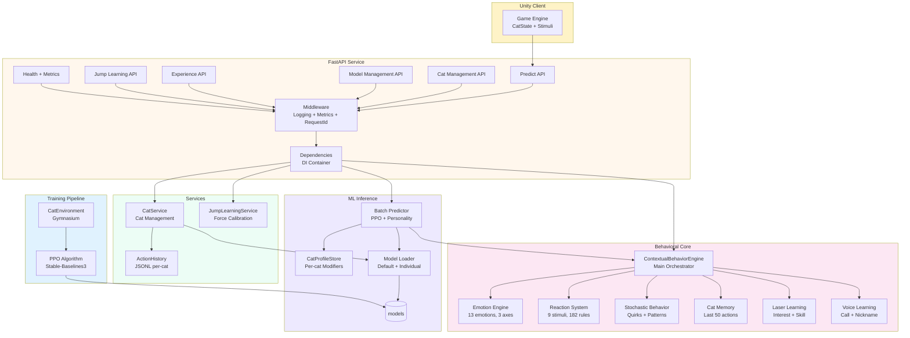
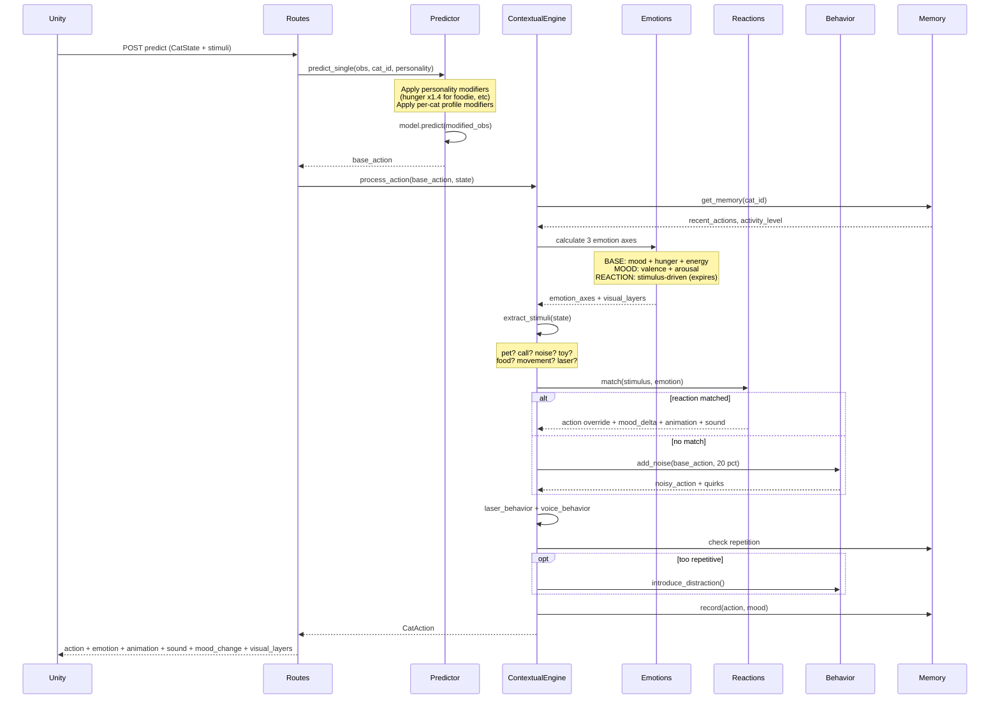
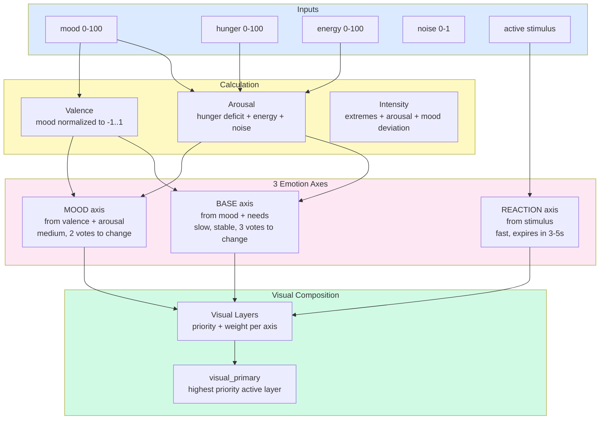
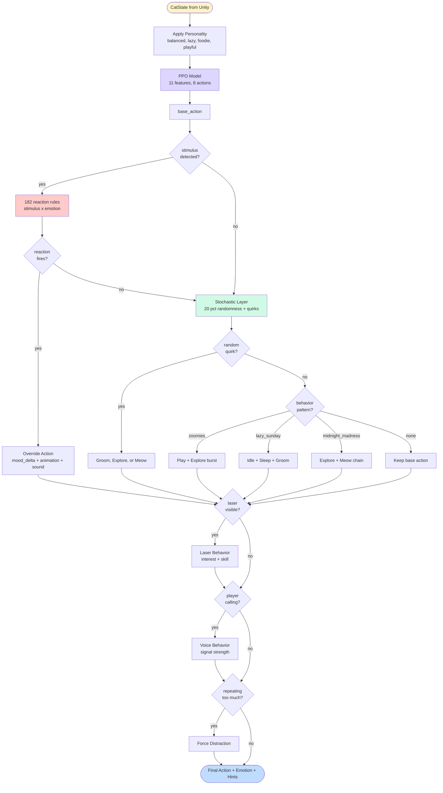
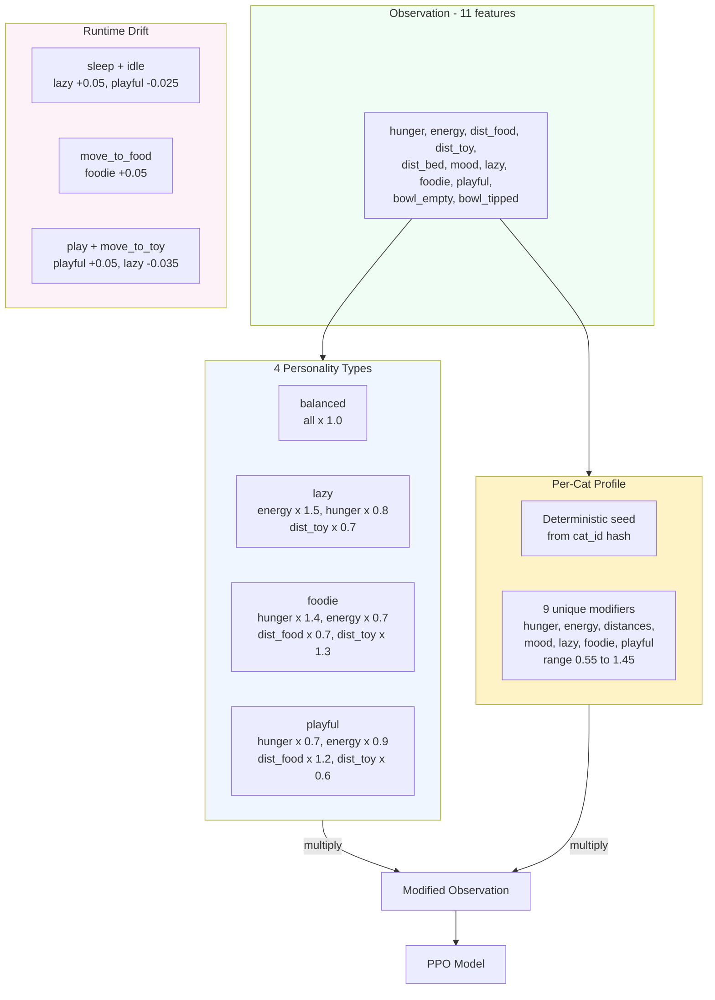
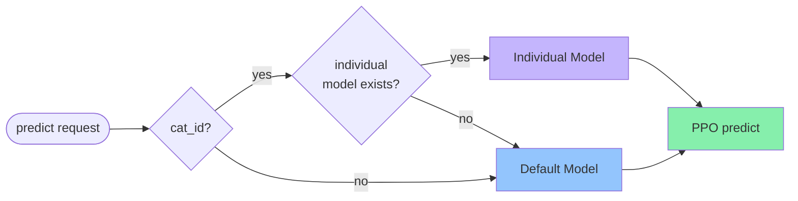

# Cat Brain Service

living cat ai with emotions, reactions, and realistic behavior

## System Architecture


```mermaid
graph TB
    subgraph Client["Unity Client"]
        UNITY["Game Engine<br/>CatState + Stimuli"]
    end

    subgraph API["FastAPI Service"]
        PREDICT["Predict API"]
        CATS["Cat Management API"]
        MODELS["Model Management API"]
        LEARN["Experience API"]
        JUMP["Jump Learning API"]
        MONITOR["Health + Metrics"]
        MIDDLEWARE["Middleware<br/>Logging + Metrics + RequestId"]
        DEPS["Dependencies<br/>DI Container"]

        PREDICT & CATS & MODELS & LEARN & JUMP & MONITOR --> MIDDLEWARE
        MIDDLEWARE --> DEPS
    end

    subgraph Core["Behavioral Core"]
        CONTEXTUAL["ContextualBehaviorEngine<br/>Main Orchestrator"]
        EMOTIONS["Emotion Engine<br/>13 emotions, 3 axes"]
        REACTIONS["Reaction System<br/>9 stimuli, 182 rules"]
        BEHAVIOR["Stochastic Behavior<br/>Quirks + Patterns"]
        MEMORY["Cat Memory<br/>Last 50 actions"]
        LASER["Laser Learning<br/>Interest + Skill"]
        VOICE["Voice Learning<br/>Call + Nickname"]

        CONTEXTUAL --> EMOTIONS
        CONTEXTUAL --> REACTIONS
        CONTEXTUAL --> BEHAVIOR
        CONTEXTUAL --> MEMORY
        CONTEXTUAL --> LASER
        CONTEXTUAL --> VOICE
    end

    subgraph Inference["ML Inference"]
        PREDICTOR["Batch Predictor<br/>PPO + Personality"]
        PROFILE["CatProfileStore<br/>Per-cat Modifiers"]
        LOADER["Model Loader<br/>Default + Individual"]
        MODELS_STORE[("models")]

        PREDICTOR --> PROFILE
        PREDICTOR --> LOADER
        LOADER --> MODELS_STORE
    end

    subgraph Services["Services"]
        CAT_SERVICE["CatService<br/>Cat Management"]
        HISTORY["ActionHistory<br/>JSONL per-cat"]
        JUMP_SERVICE["JumpLearningService<br/>Force Calibration"]
    end

    subgraph Training["Training Pipeline"]
        ENV["CatEnvironment<br/>Gymnasium"]
        PPO["PPO Algorithm<br/>Stable-Baselines3"]
        ENV --> PPO --> MODELS_STORE
    end

    UNITY --> PREDICT
    DEPS --> PREDICTOR
    DEPS --> CONTEXTUAL
    DEPS --> CAT_SERVICE
    DEPS --> JUMP_SERVICE
    PREDICTOR --> CONTEXTUAL
    CAT_SERVICE --> HISTORY
    CAT_SERVICE --> LOADER

    style Client fill:#fef3c7
    style API fill:#fff7ed
    style Core fill:#fce7f3
    style Inference fill:#ede9fe
    style Services fill:#ecfdf5
    style Training fill:#e0f2fe
```

## Request Flow


```mermaid
sequenceDiagram
    participant U as Unity
    participant R as Routes
    participant P as Predictor
    participant C as ContextualEngine
    participant E as Emotions
    participant X as Reactions
    participant B as Behavior
    participant M as Memory

    U->>R: POST predict (CatState + stimuli)

    R->>P: predict_single(obs, cat_id, personality)
    Note over P: Apply personality modifiers<br/>(hunger x1.4 for foodie, etc)<br/>Apply per-cat profile modifiers
    P->>P: model.predict(modified_obs)
    P-->>R: base_action

    R->>C: process_action(base_action, state)
    C->>M: get_memory(cat_id)
    M-->>C: recent_actions, activity_level

    C->>E: calculate 3 emotion axes
    Note over E: BASE: mood + hunger + energy<br/>MOOD: valence + arousal<br/>REACTION: stimulus-driven (expires)
    E-->>C: emotion_axes + visual_layers

    C->>C: extract_stimuli(state)
    Note over C: pet? call? noise? toy?<br/>food? movement? laser?

    C->>X: match(stimulus, emotion)

    alt reaction matched
        X-->>C: action override + mood_delta + animation + sound
    else no match
        C->>B: add_noise(base_action, 20 pct)
        B-->>C: noisy_action + quirks
    end

    C->>C: laser_behavior + voice_behavior
    C->>M: check repetition
    opt too repetitive
        C->>B: introduce_distraction()
    end

    C->>M: record(action, mood)
    C-->>R: CatAction

    R-->>U: action + emotion + animation + sound + mood_change + visual_layers
```

## Emotion System


```mermaid
graph TD
    subgraph Inputs
        MOOD["mood 0-100"]
        HUNGER["hunger 0-100"]
        ENERGY["energy 0-100"]
        NOISE["noise 0-1"]
        STIMULUS["active stimulus"]
    end

    subgraph Calculation
        AROUSAL["Arousal<br/>hunger deficit + energy + noise"]
        VALENCE["Valence<br/>mood normalized to -1..1"]
        INTENSITY["Intensity<br/>extremes + arousal + mood deviation"]
    end

    subgraph ThreeAxes["3 Emotion Axes"]
        BASE["BASE axis<br/>from mood + needs<br/>slow, stable, 3 votes to change"]
        MOOD_AX["MOOD axis<br/>from valence + arousal<br/>medium, 2 votes to change"]
        REACT["REACTION axis<br/>from stimulus<br/>fast, expires in 3-5s"]
    end

    subgraph Compose["Visual Composition"]
        LAYERS["Visual Layers<br/>priority + weight per axis"]
        PRIMARY["visual_primary<br/>highest priority active layer"]
    end

    MOOD & HUNGER & ENERGY --> AROUSAL
    MOOD --> VALENCE
    AROUSAL & VALENCE --> BASE & MOOD_AX
    STIMULUS --> REACT

    BASE & MOOD_AX & REACT --> LAYERS --> PRIMARY

    style Inputs fill:#dbeafe
    style Calculation fill:#fef9c3
    style ThreeAxes fill:#fce7f3
    style Compose fill:#d1fae5
```

### 13 emotions

| positive | negative | neutral |
|----------|----------|---------|
| happy | scared | curious |
| excited | anxious | sleepy |
| playful | grumpy | hungry |
| affectionate | annoyed | demanding |
| content | | |
| relaxed | | |

### 4 intensity levels
`subtle` < `moderate` < `strong` < `intense`

## Decision Pipeline


```mermaid
flowchart TD
    STATE(["CatState from Unity"]) --> PERSONALITY

    PERSONALITY["Apply Personality<br/>balanced, lazy, foodie, playful"] --> MODEL
    MODEL["PPO Model<br/>11 features, 8 actions"] --> BASE

    BASE["base_action"] --> STIMULUS{"stimulus<br/>detected?"}

    STIMULUS -->|yes| RULES["182 reaction rules<br/>stimulus x emotion"]
    STIMULUS -->|no| NOISE["Stochastic Layer<br/>20 pct randomness + quirks"]

    RULES --> OVERRIDE{"reaction<br/>fires?"}
    OVERRIDE -->|yes| REACTION_ACTION["Override Action<br/>mood_delta + animation + sound"]
    OVERRIDE -->|no| NOISE

    NOISE --> QUIRK{"random<br/>quirk?"}
    QUIRK -->|yes| QUIRK_ACTION["Groom, Explore, or Meow"]
    QUIRK -->|no| PATTERN{"behavior<br/>pattern?"}

    PATTERN -->|zoomies| ZOOMIES["Play + Explore burst"]
    PATTERN -->|lazy_sunday| LAZY["Idle + Sleep + Groom"]
    PATTERN -->|midnight_madness| MIDNIGHT["Explore + Meow chain"]
    PATTERN -->|none| PASS["Keep base action"]

    REACTION_ACTION & QUIRK_ACTION & ZOOMIES & LAZY & MIDNIGHT & PASS --> LASER{"laser<br/>visible?"}

    LASER -->|yes| LASER_LEARN["Laser Behavior<br/>interest + skill"]
    LASER -->|no| VOICE{"player<br/>calling?"}

    LASER_LEARN --> VOICE

    VOICE -->|yes| VOICE_LEARN["Voice Behavior<br/>signal strength"]
    VOICE -->|no| REPETITION

    VOICE_LEARN --> REPETITION

    REPETITION{"repeating<br/>too much?"} -->|yes| DISTRACT["Force Distraction"]
    REPETITION -->|no| FINAL

    DISTRACT --> FINAL(["Final Action + Emotion + Hints"])

    style STATE fill:#fef3c7
    style MODEL fill:#ddd6fe
    style RULES fill:#fecaca
    style NOISE fill:#d1fae5
    style FINAL fill:#bfdbfe
```

## Personality System


```mermaid
graph TD
    subgraph InputObs["Observation - 11 features"]
        OBS["hunger, energy, dist_food, dist_toy,<br/>dist_bed, mood, lazy, foodie, playful,<br/>bowl_empty, bowl_tipped"]
    end

    subgraph Types["4 Personality Types"]
        BAL["balanced<br/>all x 1.0"]
        LAZ["lazy<br/>energy x 1.5, hunger x 0.8<br/>dist_toy x 0.7"]
        FOO["foodie<br/>hunger x 1.4, energy x 0.7<br/>dist_food x 0.7, dist_toy x 1.3"]
        PLA["playful<br/>hunger x 0.7, energy x 0.9<br/>dist_food x 1.2, dist_toy x 0.6"]
    end

    subgraph PerCat["Per-Cat Profile"]
        SEED["Deterministic seed<br/>from cat_id hash"]
        MODS["9 unique modifiers<br/>hunger, energy, distances,<br/>mood, lazy, foodie, playful<br/>range 0.55 to 1.45"]
    end

    subgraph Drift["Runtime Drift"]
        SLEEP_IDLE["sleep + idle<br/>lazy +0.05, playful -0.025"]
        EAT["move_to_food<br/>foodie +0.05"]
        PLAY_TOY["play + move_to_toy<br/>playful +0.05, lazy -0.035"]
    end

    OBS --> Types -->|multiply| MODIFIED["Modified Observation"]
    OBS --> PerCat -->|multiply| MODIFIED
    MODIFIED --> MODEL["PPO Model"]

    style InputObs fill:#f0fdf4
    style Types fill:#eff6ff
    style PerCat fill:#fef3c7
    style Drift fill:#fdf2f8
```

## Actions

| # | action | description |
|---|--------|-------------|
| 0 | idle | stand around, do nothing |
| 1 | move_to_food | walk to food bowl |
| 2 | move_to_toy | approach nearest toy |
| 3 | sleep | find spot and nap |
| 4 | groom | self-grooming |
| 5 | play | play with toy or laser |
| 6 | explore | wander around |
| 7 | meow_at_bowl | sit at bowl, meow for food |

## 9 Stimulus Types

| stimulus | trigger condition |
|----------|-------------------|
| player_approach | player_nearby && distance < threshold |
| player_pet | is_being_petted |
| player_call | is_player_calling |
| loud_noise | loud_noise_level > 0.3 |
| new_toy | new_toy_appeared |
| food_refill | food_bowl_refilled |
| door_open | sudden_movement (approximation) |
| sudden_movement | sudden_movement flag |
| unknown_person | (reserved) |

## Model Selection


```mermaid
flowchart LR
    REQ(["predict request"]) --> HAS_ID{"cat_id?"}

    HAS_ID -->|yes| CHECK{"individual<br/>model exists?"}
    HAS_ID -->|no| DEFAULT

    CHECK -->|yes| INDIVIDUAL["Individual Model"]
    CHECK -->|no| DEFAULT["Default Model"]

    INDIVIDUAL --> PREDICT["PPO predict"]
    DEFAULT --> PREDICT

    style DEFAULT fill:#93c5fd
    style INDIVIDUAL fill:#c4b5fd
    style PREDICT fill:#86efac
```

## Endpoints

| method | path | description |
|--------|------|-------------|
| POST | `/predict` | predict single action |
| POST | `/predict_batch` | predict for multiple cats |
| POST | `/cats` | create cat with personality |
| GET | `/cats/{id}` | get cat info |
| GET | `/cats/{id}/profile` | get personality profile + modifiers |
| GET | `/models` | list model versions |
| GET | `/models/{version}` | model metadata |
| POST | `/experience` | submit single experience |
| POST | `/experience/batch` | submit batch experiences |
| POST | `/jump/predict` | predict jump force |
| POST | `/jump/result` | record jump outcome |
| GET | `/jump/memory/{id}` | get jump memories |
| DELETE | `/jump/memory/{id}/{target}` | reset jump target memory |
| GET | `/health` `/ready` `/live` | health probes |
| GET | `/metrics` | prometheus metrics |

## How to Run

### dev

```bash
python -m venv venv
source venv/bin/activate
pip install -r requirements.txt

uvicorn src.api.main:app --reload --host 0.0.0.0 --port 8000

python -m src.training.trainer
```

### docker

```bash
cd docker
docker-compose up --build
```

api: `localhost:8000`
docs: `localhost:8000/docs`

## Response Format

```json
{
  "action": 5,
  "action_name": "play",
  "emotion": "playful",
  "emotion_intensity": "strong",
  "mood_change": 12.0,
  "arousal_level": 0.65,
  "animation_hint": "playful_approach",
  "sound_hint": "chirp",
  "reaction_triggered": true,
  "behavior_pattern": "zoomies",
  "emotion_axes": {
    "base":     { "emotion": "content",  "intensity": 0.4, "source": "base" },
    "mood":     { "emotion": "happy",    "intensity": 0.6, "source": "mood" },
    "reaction": { "emotion": "playful",  "intensity": 0.8, "source": "reaction", "expires_at": 1710... }
  },
  "visual_layers": [
    { "source": "reaction", "emotion": "playful", "intensity": 0.8, "priority": 10, "weight": 1.0 },
    { "source": "mood",     "emotion": "happy",   "intensity": 0.6, "priority": 5,  "weight": 0.7 },
    { "source": "base",     "emotion": "content", "intensity": 0.4, "priority": 1,  "weight": 0.5 }
  ],
  "visual_primary": "playful"
}
```

## Animation & Sound Hints

### animations
`purr` `scared` `excited` `startle` `hide` `run_hide` `run_to_food` `playful_approach` `rub_legs` `tail_flick` `ignore` `pounce` `alert` `slow_approach` `knead`

### sounds
`purr` `purr_soft` `meow_excited` `meow_annoyed` `meow_urgent` `meow_response` `meow_demand` `hiss` `chirp` `growl` `trill`

## Behavioral Patterns

| pattern | trigger | actions |
|---------|---------|---------|
| zoomies | high energy burst | play + explore chains |
| lazy_sunday | low energy | idle + sleep + groom |
| midnight_madness | nighttime + energy | explore + meow chains |
| morning_routine | morning | groom + eat + explore |
| food_obsession | high hunger | move_to_food + meow_at_bowl |

## Key Config

```
MODEL_PATH         = ./models
TOTAL_TIMESTEPS    = 100,000
CACHE_ENABLED      = false (optional redis)
CACHE_TTL          = 300s
MEMORY_SIZE        = 50 actions per cat
HISTORY_MAX        = 500 entries per cat JSONL
RANDOMNESS         = 20%
```

## Customization

### add personality
edit `src/core/config.py`:
```python
"custom": {
    "hunger": 1.2,
    "energy": 0.9,
    "distance_food": 0.8,
    "distance_toy": 1.1
}
```

### add reaction
edit `src/core/reactions.py`:
```python
(StimulusType.PLAYER_PET, EmotionType.HAPPY): ReactionModifier(
    action_probabilities={4: 0.6},
    mood_delta=15.0,
    animation_hint="purr",
    sound_hint="purr",
    probability=0.85
)
```

### add emotion
edit `src/core/emotions.py`:
```python
class EmotionType(Enum):
    MISCHIEVOUS = "mischievous"

EMOTION_THRESHOLDS = {
    EmotionType.MISCHIEVOUS: {
        "mood_min": 60, "energy_min": 70, "arousal_min": 0.6
    }
}
```
